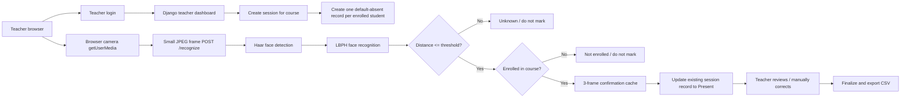
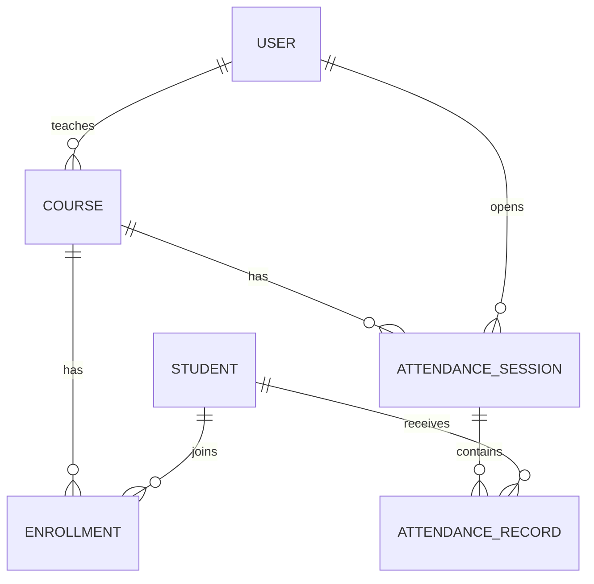

# Portal architecture

```mermaid
flowchart LR
  T[Teacher browser] --> L[Teacher login]
  L --> D[Django teacher dashboard]
  D --> S[Create session for course]
  S --> R[Create one default-absent record per enrolled student]
  T --> C[Browser camera getUserMedia]
  C --> F[Small JPEG frame POST /recognize]
  F --> H[Haar face detection]
  H --> B[LBPH face recognition]
  B --> Q{Distance <= threshold?}
  Q -- No --> U[Unknown / do not mark]
  Q -- Yes --> K{Enrolled in course?}
  K -- No --> N[Not enrolled / do not mark]
  K -- Yes --> X[3-frame confirmation cache]
  X --> A[Update existing session record to Present]
  A --> M[Teacher reviews / manually corrects]
  M --> Z[Finalize and export CSV]
```

## Data model

```mermaid
erDiagram
  USER ||--o{ COURSE : teaches
  COURSE ||--o{ ENROLLMENT : has
  STUDENT ||--o{ ENROLLMENT : joins
  COURSE ||--o{ ATTENDANCE_SESSION : has
  USER ||--o{ ATTENDANCE_SESSION : opens
  ATTENDANCE_SESSION ||--o{ ATTENDANCE_RECORD : contains
  STUDENT ||--o{ ATTENDANCE_RECORD : receives
```

The recognition model is stored locally under `models/`. Image frames are processed in memory by the recognition endpoint and are not saved by the portal.
